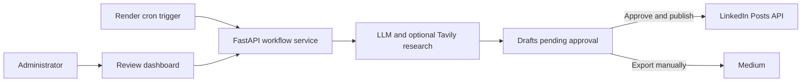

# Daily Content Automation

A production-minded FastAPI service for teams that need a reliable daily content workflow without handing publishing authority to an LLM. It researches a topic, generates LinkedIn and long-form drafts, and requires a human decision before anything can be published.

## Why this project

- **Human approval is mandatory.** Generated material remains in `PENDING_APPROVAL` until an administrator explicitly approves it.
- **Publishing is guarded.** LinkedIn publishing is opt-in and disabled by default; every publish action follows an explicit approval path.
- **Content is research-aware.** Selectable LLM providers and optional Tavily research support current, credible technology content.
- **Operations are deployment-ready.** Render's dedicated cron service triggers the workflow at 11:00 Asia/Kolkata without relying on an in-process scheduler.
- **Medium remains compliant.** Articles can be reviewed and exported for manual publishing; the service intentionally does not automate Medium posting.

## Architecture



## Core workflow

1. A scheduled or manual job creates a technology-content brief.
2. The service researches and generates a LinkedIn post plus a long-form article.
3. An administrator edits, approves, or rejects the content in the dashboard.
4. Approved content can be published to LinkedIn when publishing is enabled.
5. Long-form content is retained for compliant manual publication to Medium.

## Important publishing rule

Medium's current API Terms prohibit using the Medium API to post automatically generated content. This project therefore does **not** implement automatic Medium API publishing. The application keeps the Medium article in the approval workflow so you can copy/export it and publish it manually through Medium.

LinkedIn automatic publishing is supported when you have an approved LinkedIn application/token with the required permission.

## Local setup

```powershell
py -3.12 -m venv .venv
.\.venv\Scripts\Activate.ps1
python -m pip install -r requirements.txt
Copy-Item .env.example .env
```

Set:

```env
LLM_PROVIDER=gemini
GEMINI_API_KEY=...
TAVILY_API_KEY=... # optional; enables current-topic research
GEMINI_MODEL=gemini-3.5-flash-lite
ADMIN_TOKEN=some-long-random-secret
CRON_SECRET=another-long-random-secret
PUBLISH_ENABLED=false
```

Run:

```powershell
uvicorn backend.app.main:app --reload --host 127.0.0.1 --port 8000
```

Open:

- http://127.0.0.1:8000/
- http://127.0.0.1:8000/docs
- http://127.0.0.1:8000/health

## Production on Render

Create a PostgreSQL database on Render and put its internal/external connection string into `DATABASE_URL`.

Create a Web Service from this repository. The included `render.yaml` defines the web service and the daily cron trigger.

Render cron schedules are UTC. 11:00 Asia/Kolkata = 05:30 UTC, so the cron is:

```text
30 5 * * *
```

Set `APP_URL` on the cron service to the deployed web service URL, for example:

```text
https://daily-content-automation.onrender.com
```

Set the same `CRON_SECRET` on both services.

### Production safety sequence

Start with:

```env
PUBLISH_ENABLED=false
LINKEDIN_ENABLED=false
```

Verify:

1. `/health`
2. `/docs`
3. Create job
4. Run job
5. Content reaches `PENDING_APPROVAL`
6. Edit content
7. Approve
8. Test reject
9. Test approve-and-publish with publishing still disabled and verify it is blocked.

Only after that configure LinkedIn and enable publishing.

## Status machine

```text
DRAFT
  -> GENERATING
  -> PENDING_APPROVAL
  -> APPROVED
  -> PUBLISHED

PENDING_APPROVAL -> REJECTED
ANY PROCESSING STATE -> FAILED
```

Human approval is mandatory before publishing.

## API

All admin APIs require:

```http
Authorization: Bearer <ADMIN_TOKEN>
```

Endpoints:

- `GET /health`
- `GET /api/jobs`
- `POST /api/jobs`
- `POST /api/jobs/{id}/run`
- `PATCH /api/contents/{id}`
- `POST /api/jobs/{id}/approve`
- `POST /api/jobs/{id}/reject?reason=...`
- `POST /api/jobs/{id}/publish`
- `POST /api/jobs/{id}/approve-and-publish`

Internal scheduler endpoint:

```http
POST /api/internal/daily-run
X-Cron-Secret: <CRON_SECRET>
```

## Notes

This project deliberately avoids a scheduler running inside the web process. Render's dedicated cron service triggers the daily generation, which is more reliable than depending on an always-running web process.

For local testing, use `LLM_PROVIDER=mock` to exercise the workflow without consuming model quota.
